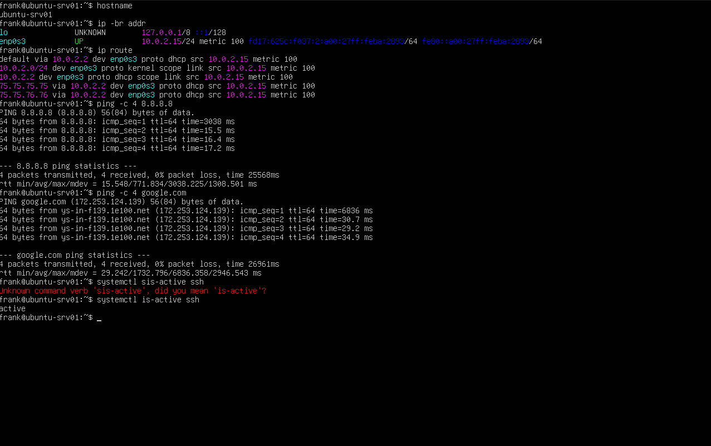
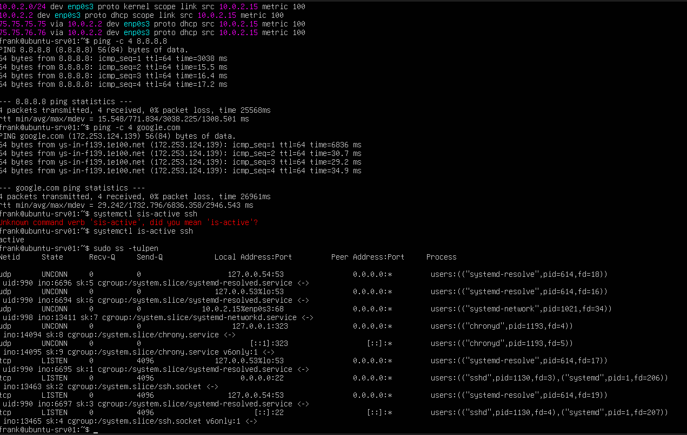
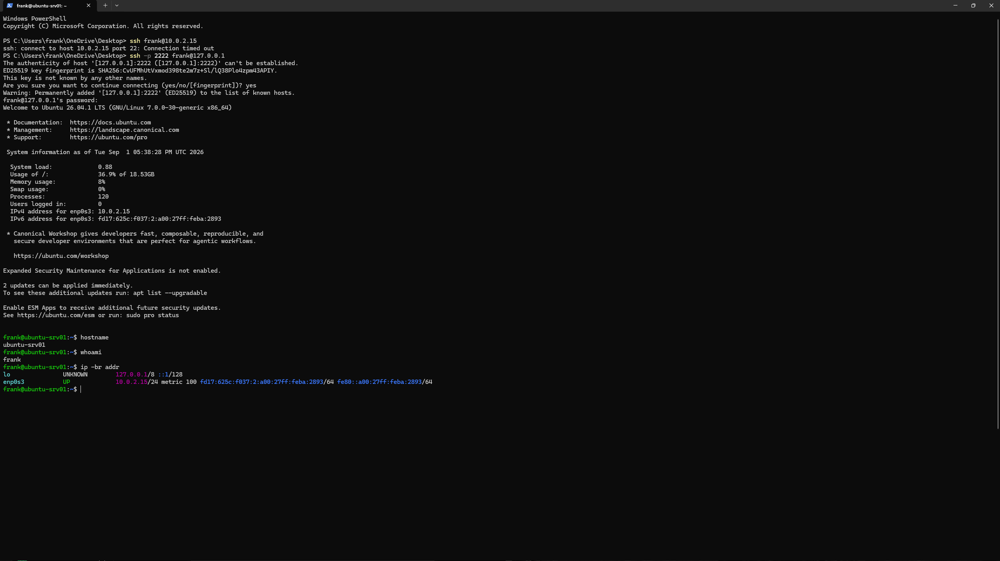

# Lab 01 - Ubuntu Server Deployment and Network Validation

## Objective

Deploy an Ubuntu Server virtual machine in Oracle VirtualBox and verify its network configuration, internet connectivity, DNS resolution, and SSH service.

## Environment

- **Host OS:** Windows 11
- **Hypervisor:** Oracle VirtualBox
- **Server:** Ubuntu Server 26.04.1 LTS
- **CPU:** 2 virtual CPUs
- **RAM:** 4 GB
- **Storage:** 40 GB
- **Network Mode:** NAT
- **Hostname:** ubuntu-srv01
- **Interface:** enp0s3
- **IPv4 Address:** 10.0.2.15
- **Default Gateway:** 10.0.2.2

---

## Server Deployment

I created an Ubuntu Server virtual machine in VirtualBox with 2 virtual CPUs, 4 GB of RAM, and a 40 GB virtual disk.

During installation, I configured the server hostname as:

`ubuntu-srv01`

I also installed OpenSSH Server so the system could be remotely administered.

---

## Network Validation

I checked the hostname using:

`hostname`

I viewed the network interfaces and assigned IP addresses using:

`ip -br addr`

The server received the IPv4 address:

`10.0.2.15`

I checked the routing table using:

`ip route`

The default gateway was:

`10.0.2.2`

---

## Internet Connectivity

I tested connectivity to an external IP address:

`ping -c 4 8.8.8.8`

The test succeeded with no packet loss.

This confirmed that the server had working IP connectivity and routing.

---

## DNS Validation

I tested hostname resolution using:

`ping -c 4 google.com`

The hostname successfully resolved to an IP address and responded to the ping request.

This confirmed that DNS resolution was working.

I also inspected DNS settings using:

`resolvectl status`

---

## SSH Validation

I verified that the SSH service was active:

`systemctl is-active ssh`

Result:

`active`

I checked listening ports using:

`sudo ss -tulpen`

The output showed SSH listening on TCP port 22.

---

## Remote Administration

Because the Ubuntu VM was using VirtualBox NAT, I configured port forwarding:

- **Host IP:** 127.0.0.1
- **Host Port:** 2222
- **Guest IP:** 10.0.2.15
- **Guest Port:** 22
- **Protocol:** TCP

From Windows PowerShell, I connected using:

`ssh -p 2222 frank@127.0.0.1`

After connecting, I verified the remote server with:

`hostname`

and:

`whoami`

The connection succeeded and confirmed that I could remotely administer the Ubuntu server from Windows.

---

## What I Learned

This lab helped me connect networking concepts with real system administration tasks.

I practiced:

- Checking IP configuration
- Reading routing information
- Testing external connectivity
- Verifying DNS resolution
- Checking listening ports
- Managing an SSH service
- Using NAT port forwarding
- Remotely administering Linux from Windows

I also learned that verifying connectivity requires checking multiple layers rather than relying on a single test.

---

## Screenshots

### Network Validation

The server had a valid IP address, routing information, external connectivity, and working DNS resolution.

### SSH Listening

The SSH service was listening on TCP port 22.

### Remote SSH Session

A successful SSH connection was established from Windows PowerShell to the Ubuntu server.