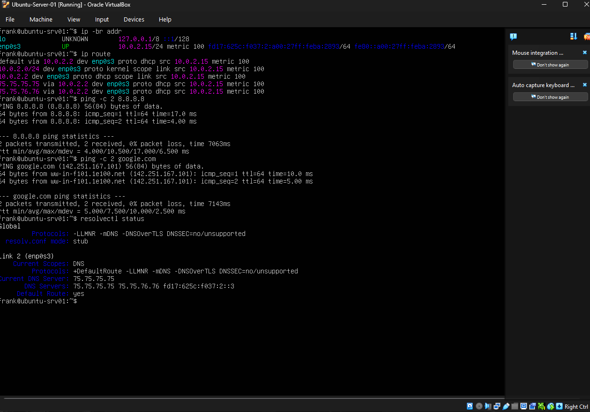
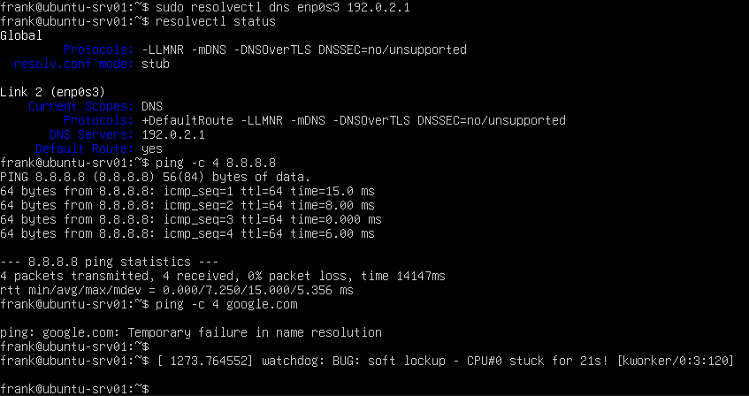
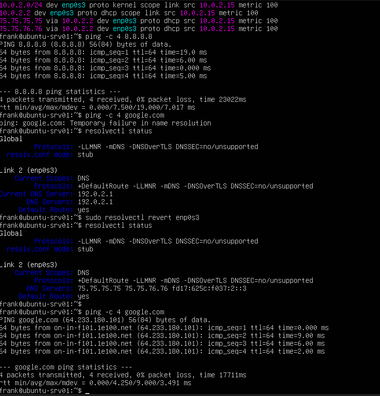

## Screenshots

### Baseline Network Configuration

Before introducing the failure, I verified that the server had a valid IP configuration, default route, external connectivity, and working DNS resolution.

### DNS Failure

The server could still reach `8.8.8.8`, confirming that IP connectivity and routing were working. However, `google.com` failed to resolve after the DNS server was changed to `192.0.2.1`.

### DNS Restored

After reverting the DNS configuration, the original DNS servers returned and hostname resolution worked again.