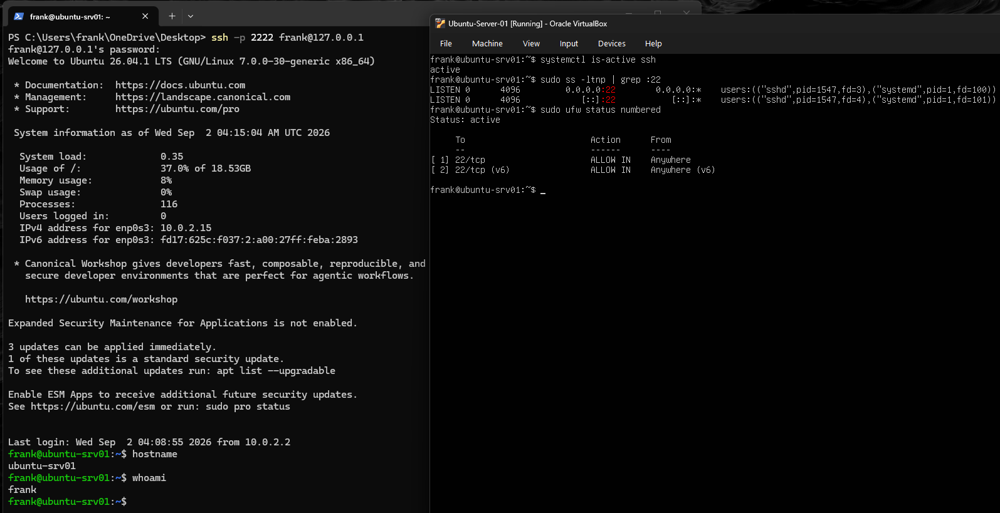
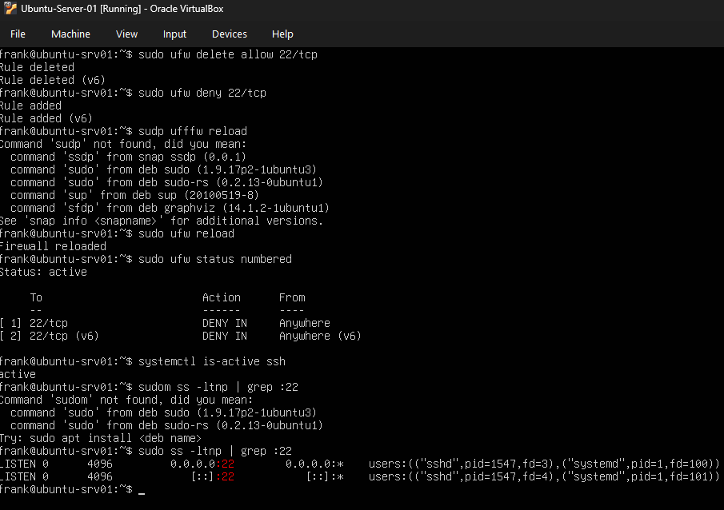
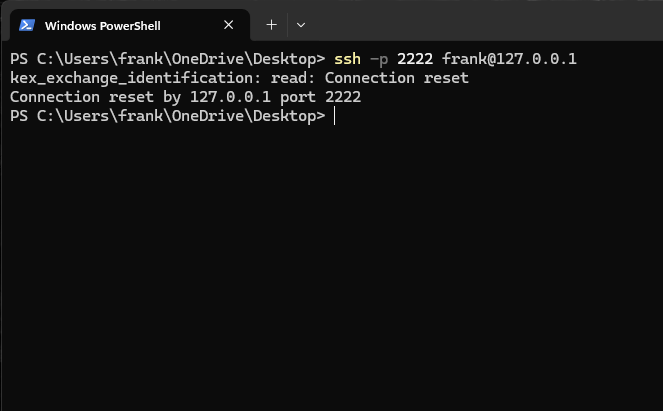
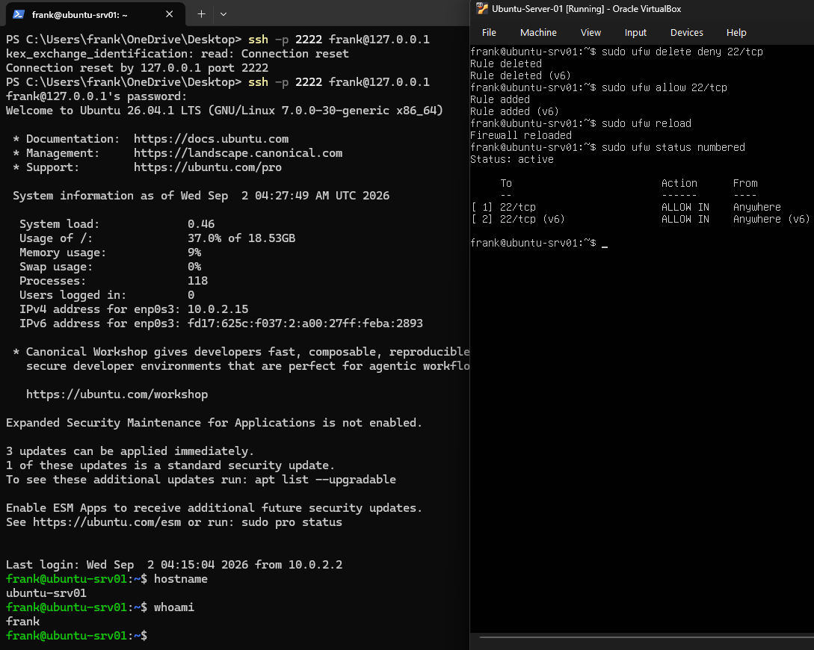

# Lab 03 - SSH Firewall Troubleshooting

## Objective

Simulate an SSH connectivity failure caused by a firewall rule, troubleshoot the issue, identify the root cause, and restore remote access.

## Scenario

The Ubuntu server was online and the SSH service was running, but remote SSH connections from my Windows 11 host were failing.

The goal was to determine whether the problem was caused by:

- Network connectivity
- The SSH service
- TCP port 22
- The firewall

## Environment

- **Host OS:** Windows 11
- **Hypervisor:** Oracle VirtualBox
- **Server:** Ubuntu Server 26.04.1 LTS
- **Network Mode:** NAT
- **Ubuntu IP:** 10.0.2.15
- **SSH Port:** TCP 22
- **VirtualBox Host Port:** TCP 2222
- **Firewall:** UFW

---

## Baseline Validation

Before creating the problem, I verified that SSH was working normally.

On Ubuntu, I checked the SSH service:

`systemctl is-active ssh`

Result:

`active`

I verified that TCP port 22 was listening:

`sudo ss -ltnp | grep :22`

I also checked the firewall rules:

`sudo ufw status numbered`

UFW allowed inbound traffic to TCP port 22.

From Windows PowerShell, I successfully connected using:

`ssh -p 2222 frank@127.0.0.1`

I verified the remote system using:

`hostname`

`whoami`

---

## Simulated Failure

I intentionally removed the firewall rule allowing SSH and created a deny rule for TCP port 22.

Commands used:

`sudo ufw delete allow 22/tcp`

`sudo ufw deny 22/tcp`

`sudo ufw reload`

I then checked the firewall:

`sudo ufw status numbered`

The firewall showed TCP port 22 as denied.

---

## Troubleshooting

I verified that the SSH service was still running:

`systemctl is-active ssh`

Result:

`active`

I then confirmed that TCP port 22 was still listening:

`sudo ss -ltnp | grep :22`

This showed that the SSH service itself was functioning.

From Windows PowerShell, I attempted a new SSH connection:

`ssh -p 2222 frank@127.0.0.1`

The connection failed with:

`Connection reset by 127.0.0.1 port 2222`

Because the SSH service was active and port 22 was listening, I investigated the firewall configuration.

The UFW rules showed that inbound TCP port 22 was being denied.

---

## Root Cause

The root cause was a UFW firewall rule denying inbound TCP traffic on port 22.

The SSH service itself was working correctly, but the firewall prevented new remote connections from reaching it.

---

## Resolution

I removed the deny rule:

`sudo ufw delete deny 22/tcp`

I then restored the SSH allow rule:

`sudo ufw allow 22/tcp`

I reloaded UFW:

`sudo ufw reload`

Finally, I verified the firewall configuration:

`sudo ufw status numbered`

TCP port 22 was once again allowed.

---

## Verification

From Windows PowerShell, I attempted another SSH connection:

`ssh -p 2222 frank@127.0.0.1`

The connection succeeded.

I verified the remote server using:

`hostname`

Result:

`ubuntu-srv01`

I also verified the logged-in account:

`whoami`

Result:

`frank`

This confirmed that remote SSH access had been successfully restored.

---

## What I Learned

This lab taught me how to separate a service problem from a firewall problem.

Even though remote SSH access failed, the SSH service remained active and TCP port 22 continued listening.

By checking the service status, listening ports, firewall rules, and remote connectivity separately, I was able to isolate UFW as the source of the problem.

The troubleshooting process was:

**Verify service → Verify listening port → Check firewall → Test remote connection → Identify root cause → Apply fix → Retest**

---

## Screenshots

### Working SSH Baseline

SSH was working before the firewall configuration was changed.

### Firewall Blocking SSH

UFW was configured to deny TCP port 22 while the SSH service remained active and listening.

### SSH Connection Failure

A new SSH connection from Windows failed after the firewall rule was changed.

### SSH Restored

After restoring the TCP port 22 allow rule, SSH access from Windows worked again.