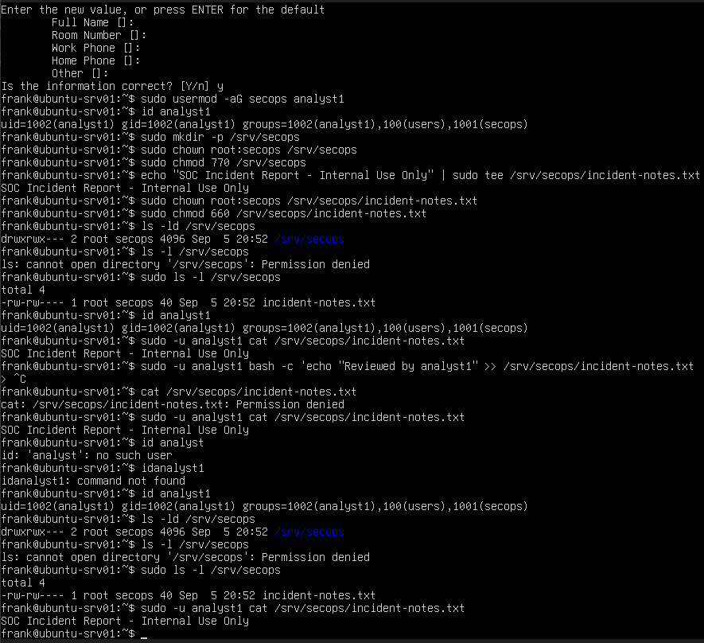
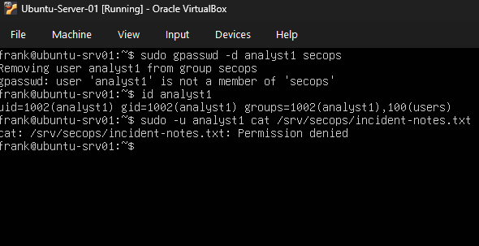
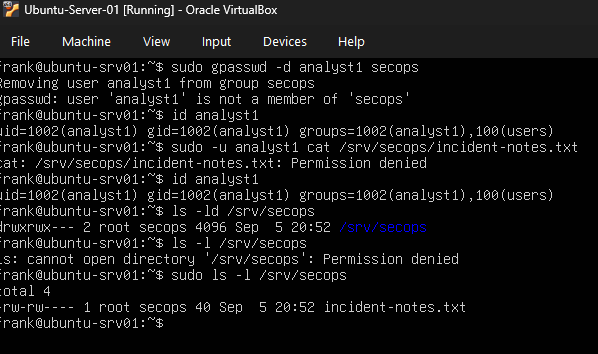
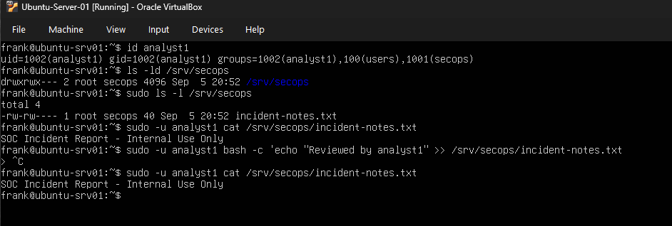

# Lab 04 - Linux Users, Groups, and Permissions Troubleshooting

## Objective

Simulate a Linux file-access issue caused by incorrect group membership, troubleshoot the problem, identify the root cause, restore access, and verify the fix.

## Scenario

A user named `analyst1` was expected to access files in the protected directory:

`/srv/secops`

The directory and file were owned by the `secops` group, but the user received a `Permission denied` error.

The goal was to determine whether the issue was caused by:

- User account configuration
- Group membership
- Directory ownership
- File ownership
- Linux permissions

## Environment

- **Host OS:** Windows 11
- **Hypervisor:** Oracle VirtualBox
- **Server:** Ubuntu Server 26.04.1 LTS
- **User:** analyst1
- **Security Group:** secops
- **Protected Directory:** /srv/secops
- **Protected File:** /srv/secops/incident-notes.txt

---

## Baseline Configuration

I created a security group named:

`secops`

I created a user named:

`analyst1`

I added the user to the `secops` group:

`sudo usermod -aG secops analyst1`

I verified the user's group membership using:

`id analyst1`

I created the protected directory:

`sudo mkdir -p /srv/secops`

I assigned the directory to the `secops` group:

`sudo chown root:secops /srv/secops`

I configured the directory permissions:

`sudo chmod 770 /srv/secops`

I created a protected file:

`/srv/secops/incident-notes.txt`

The file ownership was configured as:

`root:secops`

The file permissions were configured as:

`660`

This allowed the owner and members of the `secops` group to read and write the file, while other users had no access.

---

## Baseline Validation

I verified the user's group membership:

`id analyst1`

I inspected the protected directory:

`ls -ld /srv/secops`

I inspected the file permissions:

`sudo ls -l /srv/secops`

I tested access as `analyst1`:

`sudo -u analyst1 cat /srv/secops/incident-notes.txt`

The command succeeded, confirming that the user had authorized access through membership in the `secops` group.

---

## Simulated Failure

I intentionally removed `analyst1` from the `secops` group.

After removing the group membership, I verified the account again:

`id analyst1`

The `secops` group was no longer listed.

I then tested access:

`sudo -u analyst1 cat /srv/secops/incident-notes.txt`

The command failed with:

`Permission denied`

---

## Troubleshooting

I first inspected the user's current group memberships:

`id analyst1`

I then checked the directory ownership and permissions:

`ls -ld /srv/secops`

The directory was owned by:

`root:secops`

with permissions equivalent to:

`770`

I also checked the file ownership and permissions:

`sudo ls -l /srv/secops`

The file was owned by:

`root:secops`

with permissions equivalent to:

`660`

Because both the directory and file granted access to the `secops` group, but `analyst1` was no longer a member of that group, I identified the missing group membership as the cause of the access failure.

---

## Root Cause

The root cause was that `analyst1` was not a member of the `secops` group.

The directory and file permissions were configured correctly, but the user no longer matched the group that had access.

---

## Resolution

I restored the user's membership in the `secops` group:

`sudo usermod -aG secops analyst1`

I verified the change:

`id analyst1`

The `secops` group appeared again in the user's group memberships.

---

## Verification

I tested file access again:

`sudo -u analyst1 cat /srv/secops/incident-notes.txt`

The command succeeded.

This confirmed that access was restored after correcting the user's group membership.

I also verified that the user could write to the file.

---

## What I Learned

This lab reinforced how Linux access control depends on:

- User identity
- Group membership
- File ownership
- Directory ownership
- Read, write, and execute permissions

I learned that a `Permission denied` error does not automatically mean the file permissions themselves are incorrect.

In this case, the directory and file permissions were configured properly, but the user did not belong to the group that had access.

The troubleshooting process was:

**Verify user → Check group membership → Inspect ownership → Inspect permissions → Identify mismatch → Restore membership → Retest access**

---

## Screenshots

### Working Access Baseline

Before introducing the issue, `analyst1` was a member of the `secops` group and could successfully access the protected file.

### Permission Denied

After the `secops` group membership was removed, `analyst1` received a permission-denied error when attempting to access the file.

### Permissions Investigation

The directory and file were owned by the `secops` group, while `analyst1` was no longer a member of that group.

### Access Restored

After restoring `analyst1` to the `secops` group, access to the protected file worked again.