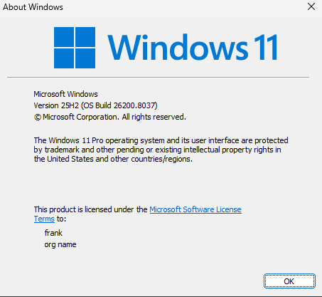
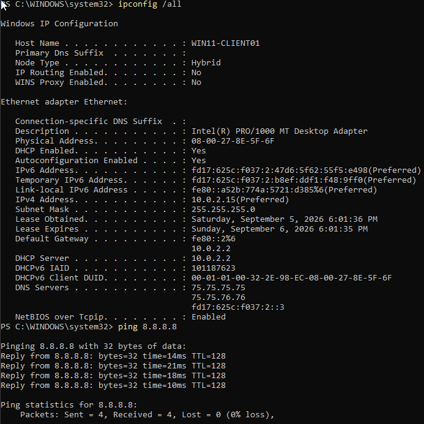
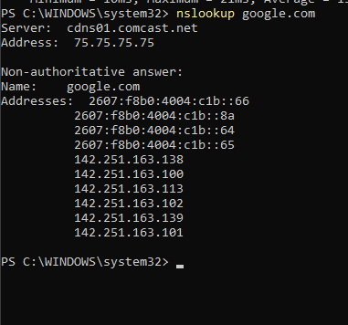
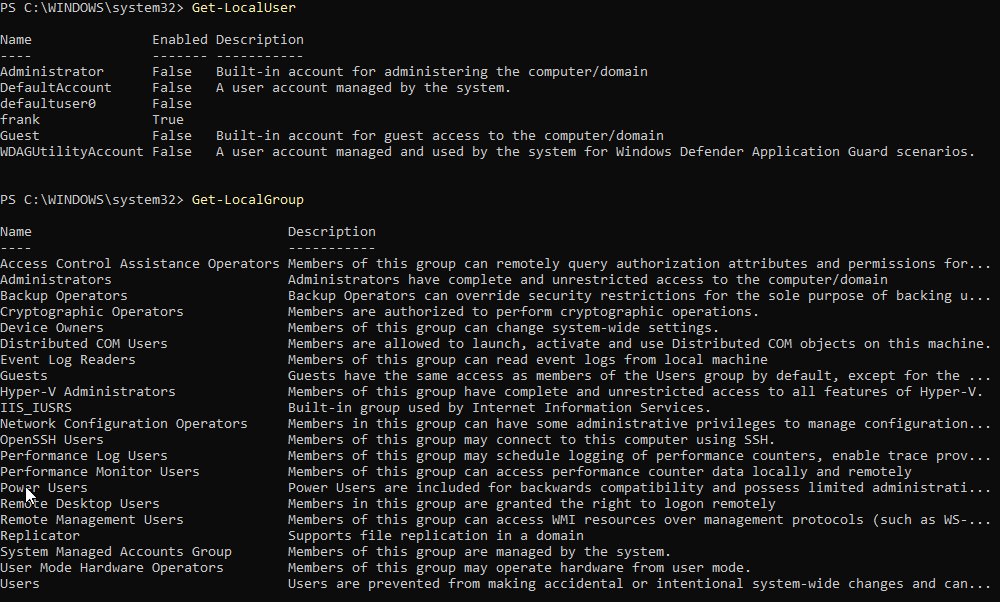
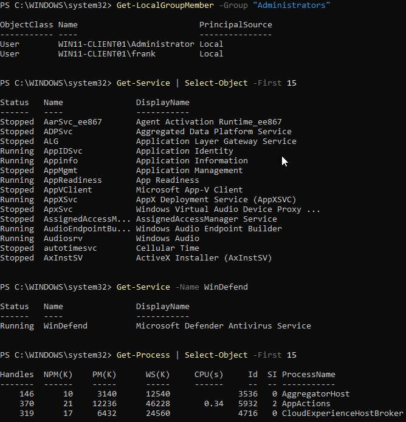
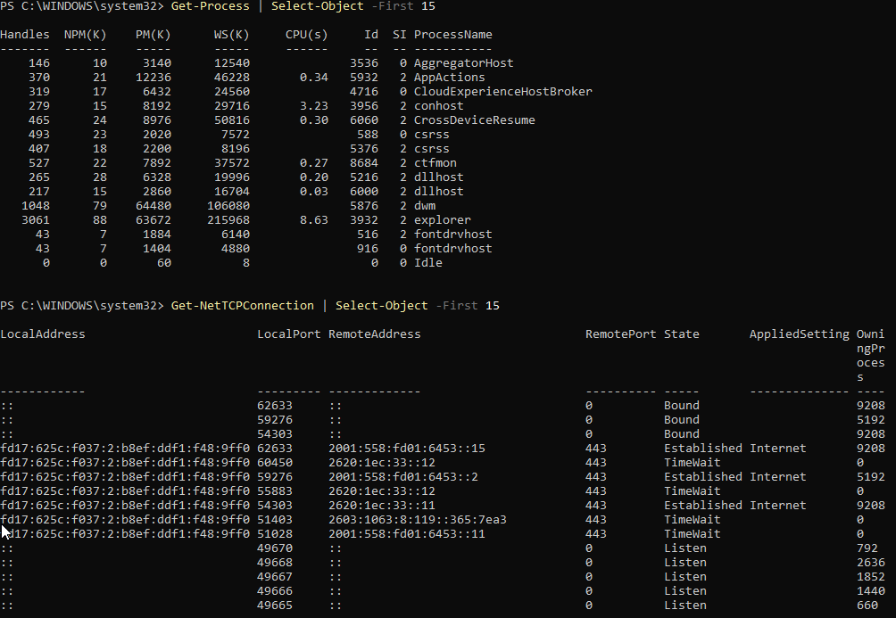
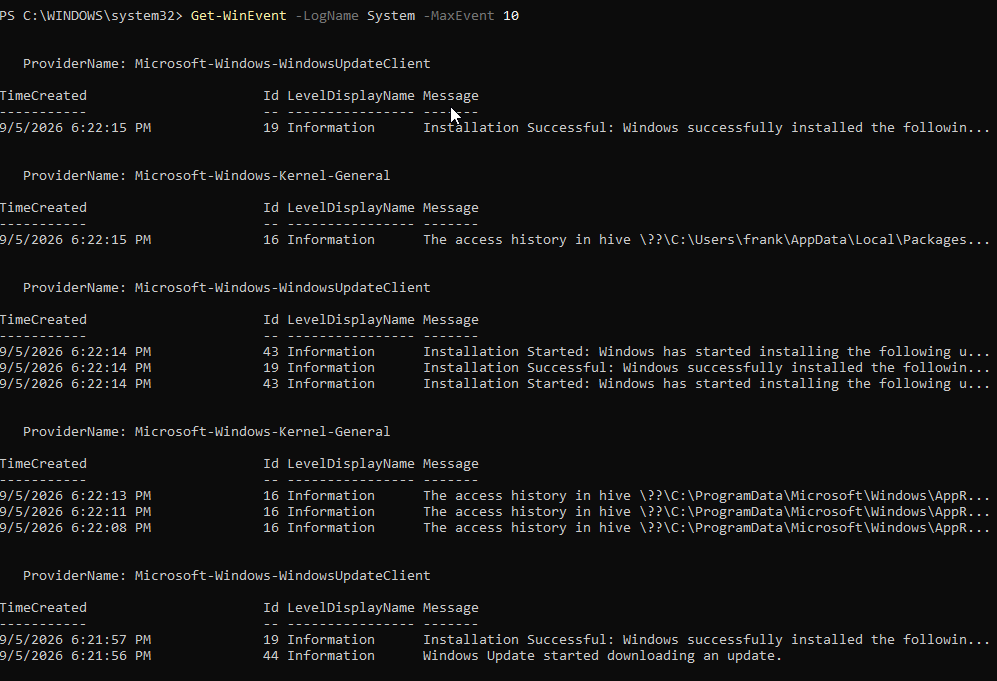

# Lab 05 - Windows 11 Client Deployment and Baseline Validation

## Objective

Deploy a Windows 11 Pro client in Oracle VirtualBox and establish a baseline for Windows administration, networking, PowerShell, local account management, endpoint security, active TCP connections, and Windows event logging.

This Windows client will later be used as a workstation in the Active Directory portion of the home lab.

---

## Environment

- **Host OS:** Windows 11
- **Hypervisor:** Oracle VirtualBox
- **Guest OS:** Windows 11 Pro
- **Windows Version:** 25H2
- **OS Build:** 26200.8037
- **Computer Name:** WIN11-CLIENT01
- **Local User:** frank
- **RAM:** 6 GB
- **CPU:** 2 virtual CPUs
- **Storage:** 80 GB
- **Network Mode:** NAT

---

## Windows Version Validation

I verified the installed Windows edition and version using:

`winver`

The system was confirmed to be running:

- Windows 11 Pro
- Version 25H2
- OS Build 26200.8037

I also verified the computer name and logged-in user using:

`hostname`

`whoami`

This confirmed the workstation identity as `WIN11-CLIENT01`.

---

## Network Configuration

I inspected the full Windows network configuration using:

`ipconfig /all`

The client received its network configuration through DHCP.

The configuration included:

- **Hostname:** WIN11-CLIENT01
- **IPv4 Address:** 10.0.2.15
- **Subnet Mask:** 255.255.255.0
- **Default Gateway:** 10.0.2.2
- **DHCP Server:** 10.0.2.2
- **DNS Servers:** configured automatically

This confirmed that the virtual network adapter was functioning and that the client had a valid network configuration.

---

## External Connectivity Test

I tested connectivity to an external IP address using:

`ping 8.8.8.8`

The test returned four successful replies with 0% packet loss.

This confirmed that the Windows client had working IP connectivity and routing.

---

## DNS Validation

I tested DNS resolution using:

`nslookup google.com`

The DNS query successfully returned multiple IPv4 and IPv6 addresses for Google.

This confirmed that DNS resolution was functioning correctly.

The network troubleshooting process was:

**Verify IP configuration → Verify gateway → Test external IP → Test DNS resolution**

---

## Local User Administration

I inspected local Windows accounts using:

`Get-LocalUser`

This displayed built-in accounts as well as the local `frank` account.

I also inspected local groups using:

`Get-LocalGroup`

This introduced Windows local account and group management through PowerShell.

---

## Local Administrator Membership

I checked which accounts belonged to the local Administrators group using:

`Get-LocalGroupMember -Group "Administrators"`

The output showed the accounts that currently had local administrative privileges on `WIN11-CLIENT01`.

Understanding local administrator membership is important because these accounts have elevated permissions on the workstation.

---

## Windows Services

I inspected Windows services using:

`Get-Service | Select-Object -First 15`

This displayed both running and stopped Windows services.

I specifically checked Microsoft Defender Antivirus using:

`Get-Service -Name WinDefend`

The result showed:

`Running`

This confirmed that Microsoft Defender Antivirus was active on the Windows client.

---

## Process Inspection

I inspected currently running processes using:

`Get-Process | Select-Object -First 15`

This displayed information including:

- Process name
- Process ID
- CPU usage
- Memory usage
- Handle count

This introduced PowerShell-based process inspection, which can later be used when investigating suspicious or abnormal activity.

---

## TCP Connection Inspection

I inspected TCP connections using:

`Get-NetTCPConnection | Select-Object -First 15`

The output displayed:

- Local addresses
- Local ports
- Remote addresses
- Remote ports
- Connection states

Several connections were using remote TCP port 443, which is commonly associated with HTTPS traffic.

The output also showed states such as:

- Established
- TimeWait
- Listen
- Bound

This demonstrated how PowerShell can be used to inspect active and listening network connections on a Windows endpoint.

---

## Windows Event Logs

I inspected recent Windows System events using:

`Get-WinEvent -LogName System -MaxEvents 10`

The output included recent events from providers such as:

- Microsoft-Windows-WindowsUpdateClient
- Microsoft-Windows-Kernel-General

These events showed operating system activity including Windows Update operations.

Windows Event Logs will become important later when investigating:

- Authentication failures
- Account activity
- System changes
- Security alerts
- Active Directory events

---

## What I Learned

This lab introduced Windows administration and endpoint inspection using PowerShell.

I practiced:

- Verifying Windows edition and build
- Identifying the workstation hostname
- Identifying the logged-in user
- Inspecting IPv4 configuration
- Identifying the default gateway
- Identifying DHCP and DNS configuration
- Testing external connectivity
- Testing DNS resolution
- Viewing local users
- Viewing local groups
- Identifying local administrators
- Inspecting Windows services
- Checking Microsoft Defender
- Viewing running processes
- Inspecting TCP connections
- Reading Windows System event logs

This Windows 11 client will later be joined to an Active Directory domain and used for domain authentication, Group Policy, Windows event logging, and security investigations.

---

## Screenshots

### Windows 11 System Baseline

The Windows client was verified as Windows 11 Pro Version 25H2.

### Windows Network Configuration and Connectivity

The client received a valid IPv4 configuration through DHCP and successfully reached the external IP address `8.8.8.8`.

### DNS Resolution

DNS resolution was successfully verified using `nslookup google.com`.

### Local Users and Groups

PowerShell was used to inspect local Windows users and groups.

### Administrators and Microsoft Defender

Local administrator membership was reviewed, Windows services were inspected, and Microsoft Defender Antivirus was confirmed to be running.

### Processes and TCP Connections

Running processes and active TCP connections were inspected using PowerShell.

### Windows Event Logs

Recent Windows System events were reviewed using `Get-WinEvent`.