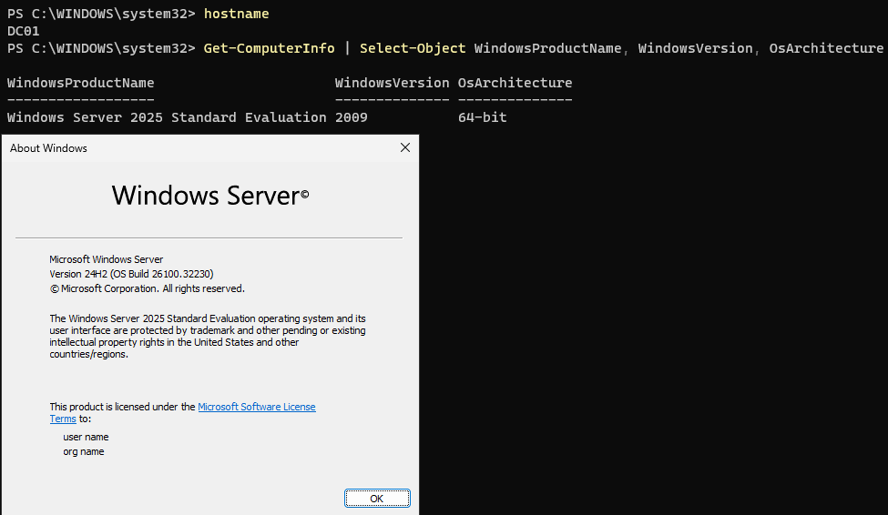
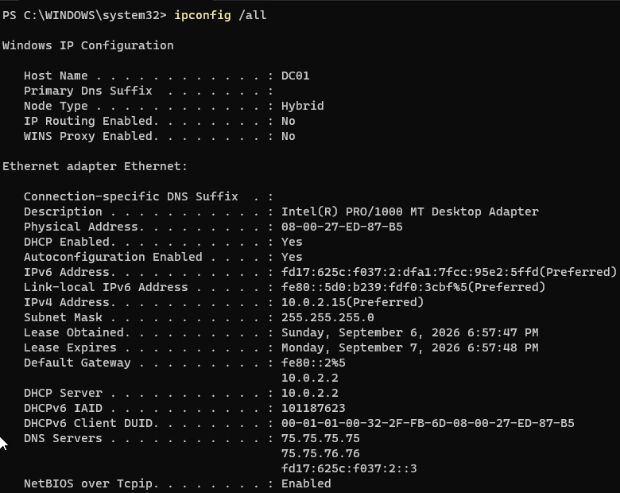
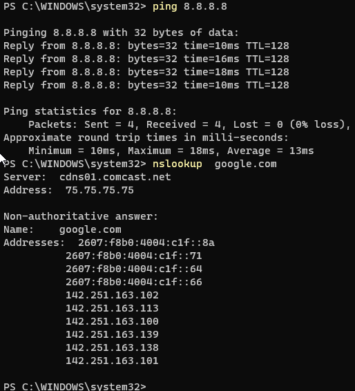
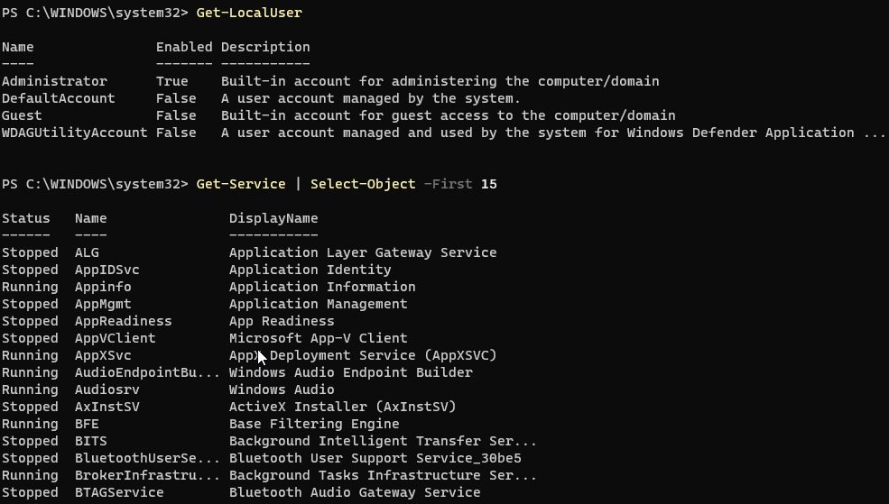
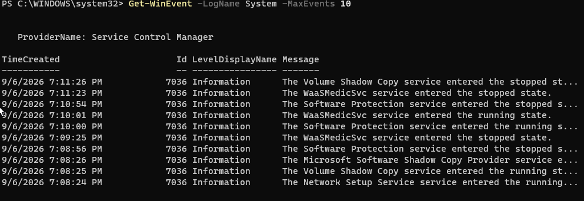

# Lab 06 - Windows Server 2025 Deployment and Baseline Validation

## Objective

Deploy Windows Server 2025 in Oracle VirtualBox, configure the server identity, validate networking and DNS, and establish a Windows Server administration baseline before installing Active Directory Domain Services.

## Environment

- **Host OS:** Windows 11
- **Hypervisor:** Oracle VirtualBox
- **Guest OS:** Windows Server 2025 Standard Evaluation
- **Version:** 24H2
- **Computer Name:** DC01
- **RAM:** 6 GB
- **CPU:** 2 virtual CPUs
- **Storage:** 80 GB
- **Network Mode:** NAT

---

## Server Identity

After installation, I renamed the server to:

`DC01`

I verified the hostname using:

`hostname`

I also verified the installed Windows Server edition using:

`winver`

The system was confirmed as Windows Server 2025 Standard Evaluation.

---

## Network Configuration

I inspected the server network configuration using:

`ipconfig /all`

The server received its IPv4 configuration through DHCP.

The server was assigned:

- **IPv4 Address:** 10.0.2.15
- **Subnet Mask:** 255.255.255.0
- **Default Gateway:** 10.0.2.2
- **DHCP Server:** 10.0.2.2

I also inspected the network configuration using:

`Get-NetIPConfiguration`

and reviewed the routing table using:

`route print`

At this stage of the lab, the server remained on VirtualBox NAT networking. A static address will be configured later when the Active Directory lab network is created.

---

## Connectivity Validation

I tested external IP connectivity using:

`ping 8.8.8.8`

The server successfully received four replies with 0% packet loss.

I then tested DNS resolution using:

`nslookup google.com`

The DNS query successfully returned IP addresses for the hostname.

This confirmed that both IP connectivity and DNS resolution were functioning.

---

## Server Manager

I opened Server Manager and reviewed the Local Server configuration.

Server Manager displayed information including:

- Computer name
- Workgroup membership
- Ethernet configuration
- Windows Firewall
- Remote management
- Remote Desktop
- Windows Update
- Operating system version

This provided an introduction to centralized Windows Server administration through the graphical interface.

---

## PowerShell Administration

I inspected local user accounts using:

`Get-LocalUser`

I inspected Windows services using:

`Get-Service | Select-Object -First 15`

This provided a baseline view of user accounts and system services running on the server.

I also inspected active and listening TCP connections using:

`Get-NetTCPConnection | Select-Object -First 15`

---

## Windows Event Logs

I reviewed recent System events using:

`Get-WinEvent -LogName System -MaxEvents 10`

The results included events from Windows services and system components.

Windows Event Logs will later be used to investigate authentication activity, Active Directory events, account changes, and security-related activity.

---

## What I Learned

This lab established the Windows Server foundation required before deploying Active Directory.

I practiced:

- Installing Windows Server 2025
- Renaming a Windows Server
- Verifying server identity
- Using Server Manager
- Inspecting IP configuration
- Reading the routing table
- Testing internet connectivity
- Testing DNS resolution
- Inspecting local users
- Inspecting Windows services
- Viewing TCP connections
- Reading Windows event logs

The next phase will configure a dedicated Active Directory network, assign the Domain Controller a static IP address, and install Active Directory Domain Services and DNS.

---

## Screenshots

### Windows Server Baseline

The server was verified as Windows Server 2025 Standard Evaluation and renamed to `DC01`.

### Server Manager

Server Manager was used to review the configuration and status of `DC01`.

### Network Configuration

The server received a valid IPv4 configuration through DHCP while connected to the VirtualBox NAT network.

### Internet Connectivity and DNS

External connectivity and DNS resolution were successfully verified using `ping` and `nslookup`.

### PowerShell Administration

PowerShell was used to inspect local user accounts and Windows services.

### Windows Event Logs

Recent System events were reviewed using PowerShell.