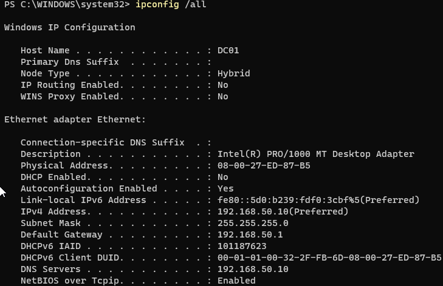
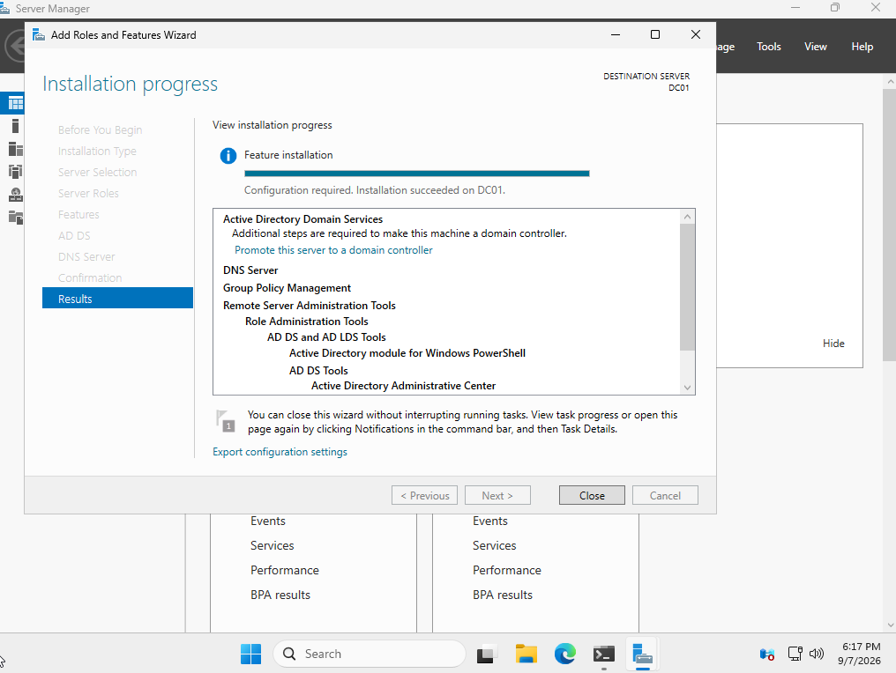
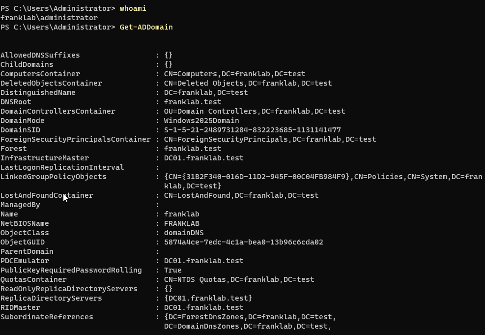
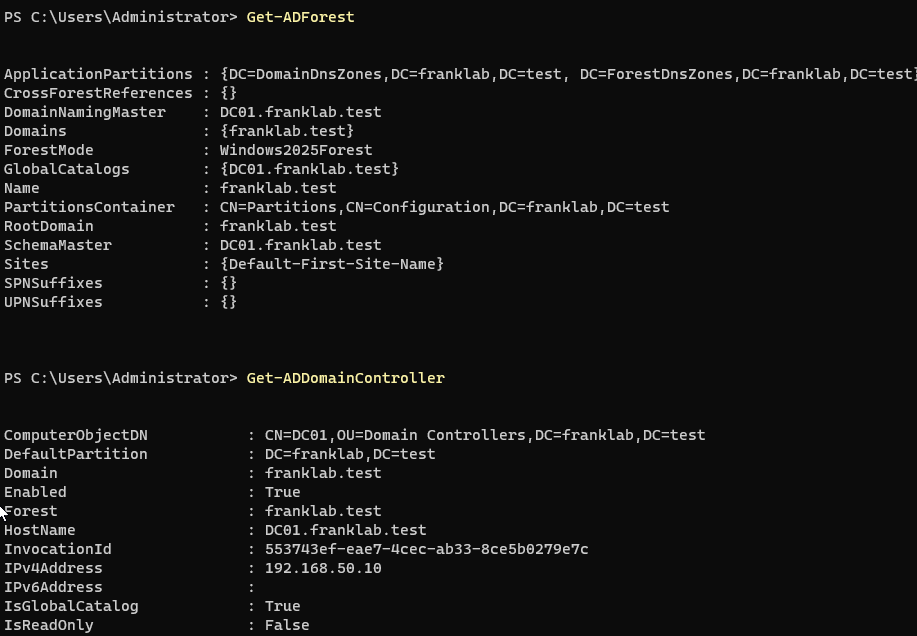
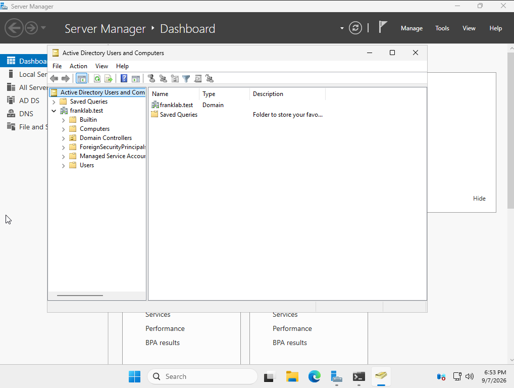
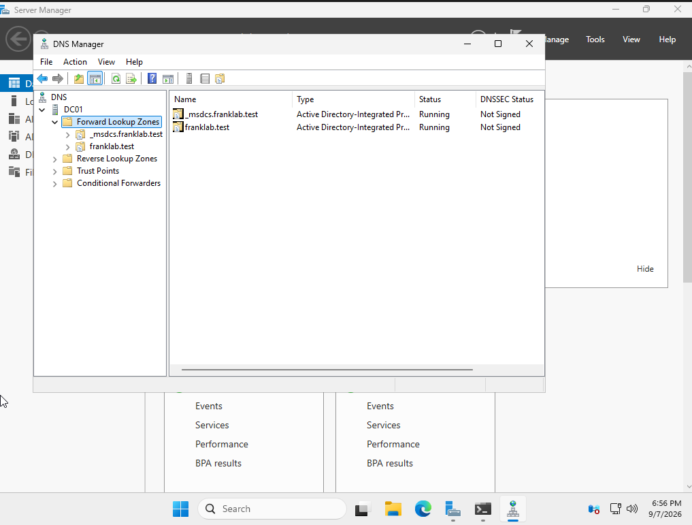

# Lab 07 - Active Directory Domain Deployment

## Objective

Configure a dedicated Active Directory network, assign a static IP address to Windows Server 2025, install Active Directory Domain Services and DNS, promote the server to a Domain Controller, and create a new Active Directory forest.

---

## Environment

- **Hypervisor:** Oracle VirtualBox
- **Domain Controller:** DC01
- **Operating System:** Windows Server 2025 Standard Evaluation
- **Domain:** franklab.test
- **NetBIOS Domain:** FRANKLAB
- **DC IPv4 Address:** 192.168.50.10
- **Subnet:** 192.168.50.0/24
- **Default Gateway:** 192.168.50.1
- **DNS Server:** 192.168.50.10

---

## Network Configuration

Before deploying Active Directory, I configured DC01 with a static IPv4 address.

The Domain Controller was assigned:

- **IPv4 Address:** 192.168.50.10
- **Subnet Mask:** 255.255.255.0
- **Default Gateway:** 192.168.50.1
- **DNS Server:** 192.168.50.10

The Domain Controller was configured to use itself as its DNS server because Active Directory relies heavily on DNS for domain services and service discovery.

---

## Active Directory Domain Services Installation

Using Server Manager, I installed the following server roles and management tools:

- Active Directory Domain Services
- DNS Server
- Group Policy Management
- Active Directory administrative tools
- Active Directory PowerShell module

After installation, Server Manager indicated that additional configuration was required to promote the server to a Domain Controller.

---

## Domain Controller Promotion

I promoted DC01 to the first Domain Controller in a new Active Directory forest.

The new root domain was configured as:

`franklab.test`

The NetBIOS domain name was:

`FRANKLAB`

DNS Server and Global Catalog functionality were enabled during the promotion process.

After the promotion completed, the server restarted and domain authentication became available.

---

## Active Directory Verification

After the restart, I verified my authentication context using:

`whoami`

The result was:

`franklab\administrator`

This confirmed that I was authenticated using the domain Administrator account rather than the previous standalone local account.

I then verified the domain using:

`Get-ADDomain`

The command returned:

- **DNS Root:** franklab.test
- **NetBIOS Name:** FRANKLAB
- **Domain Controller:** DC01.franklab.test

---

## Forest Verification

I inspected the Active Directory forest using:

`Get-ADForest`

The command confirmed:

- The forest root was `franklab.test`
- DC01 was a Global Catalog server
- The forest was successfully created

I also ran:

`Get-ADDomainController`

The output identified:

- **Host Name:** DC01.franklab.test
- **IPv4 Address:** 192.168.50.10
- **Global Catalog:** True
- **Read Only:** False

This confirmed that DC01 was functioning as a writable Domain Controller.

---

## Active Directory Users and Computers

I opened Active Directory Users and Computers and verified that the `franklab.test` domain was available.

Default Active Directory containers included:

- Builtin
- Computers
- Domain Controllers
- ForeignSecurityPrincipals
- Managed Service Accounts
- Users

This confirmed that the Active Directory directory structure had been successfully created.

---

## DNS Verification

I opened DNS Manager and inspected the DNS zones created for Active Directory.

The domain DNS infrastructure included the `franklab.test` zone and Active Directory service records.

DNS is critical to Active Directory because domain clients use DNS to locate Domain Controllers and other domain services.

---

## What I Learned

This lab introduced the core infrastructure behind Microsoft Active Directory.

I practiced:

- Creating a dedicated lab network
- Assigning a static IPv4 address to a server
- Configuring a Domain Controller to use itself for DNS
- Installing Active Directory Domain Services
- Installing the DNS Server role
- Creating a new Active Directory forest
- Promoting Windows Server to a Domain Controller
- Verifying a domain using PowerShell
- Inspecting an Active Directory forest
- Identifying the Domain Controller
- Using Active Directory Users and Computers
- Using DNS Manager

The environment now contains a functioning Active Directory domain that can be used for centralized identity, authentication, computer management, Group Policy, and security monitoring.

---

## Screenshots

### Domain Controller Static Network Configuration

DC01 was configured with the static IPv4 address `192.168.50.10` and configured to use itself as its DNS server.

### Active Directory Domain Services Installed

Active Directory Domain Services, DNS Server, Group Policy Management, and administrative tools were successfully installed.

### Active Directory Domain Verification

PowerShell confirmed domain authentication and verified the `franklab.test` Active Directory domain.

### Forest and Domain Controller Verification

PowerShell confirmed the Active Directory forest, Global Catalog, Domain Controller hostname, and static IPv4 address.

### Active Directory Users and Computers

Active Directory Users and Computers displayed the newly created `franklab.test` domain and its default containers.

### Active Directory DNS Zones

DNS Manager displayed the DNS zones used by the Active Directory domain.