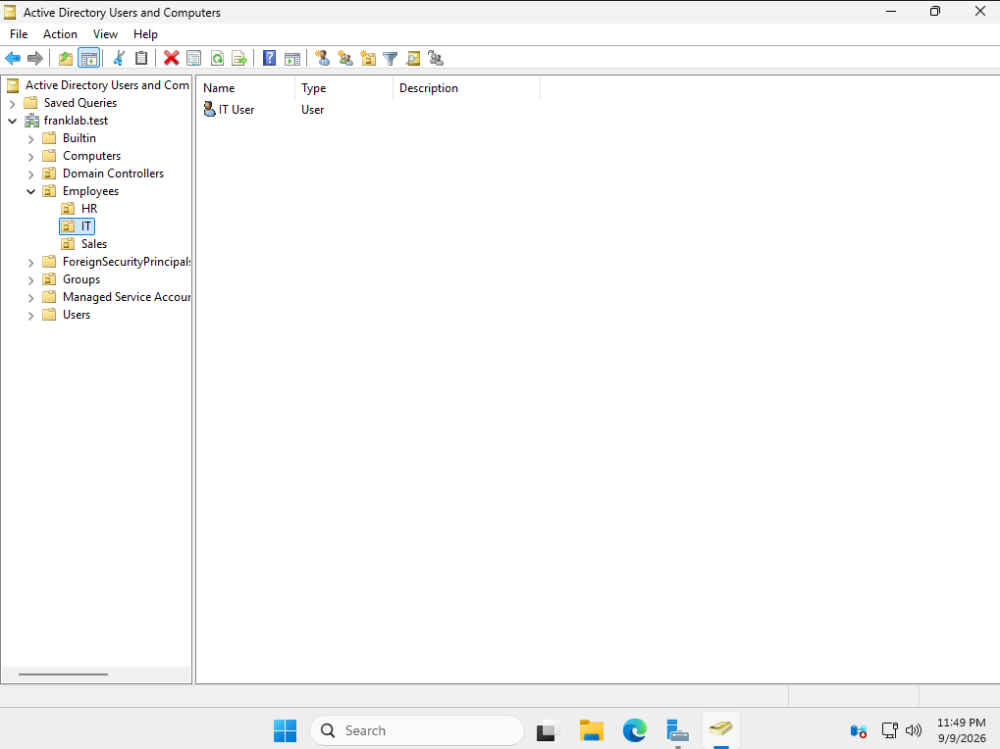
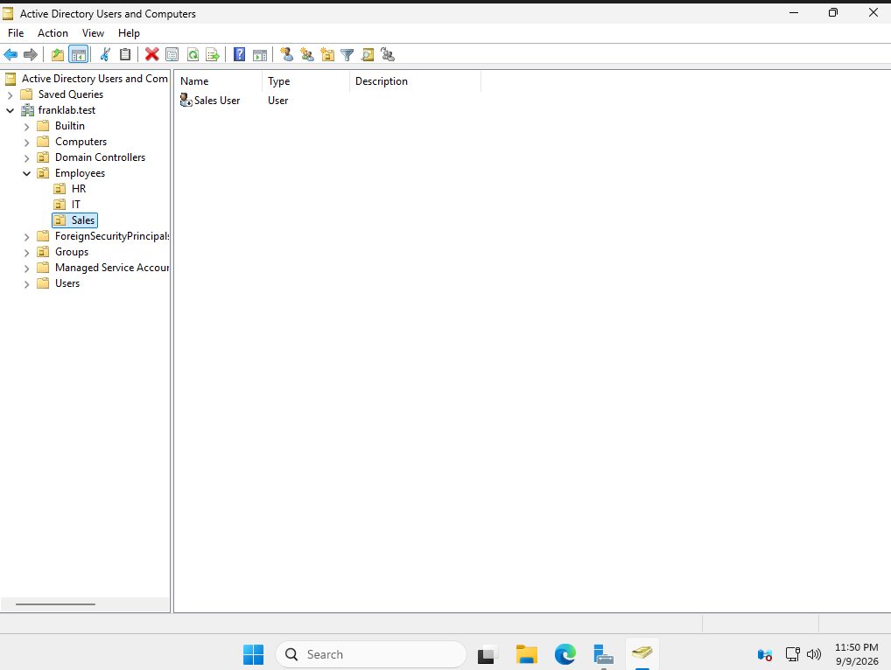
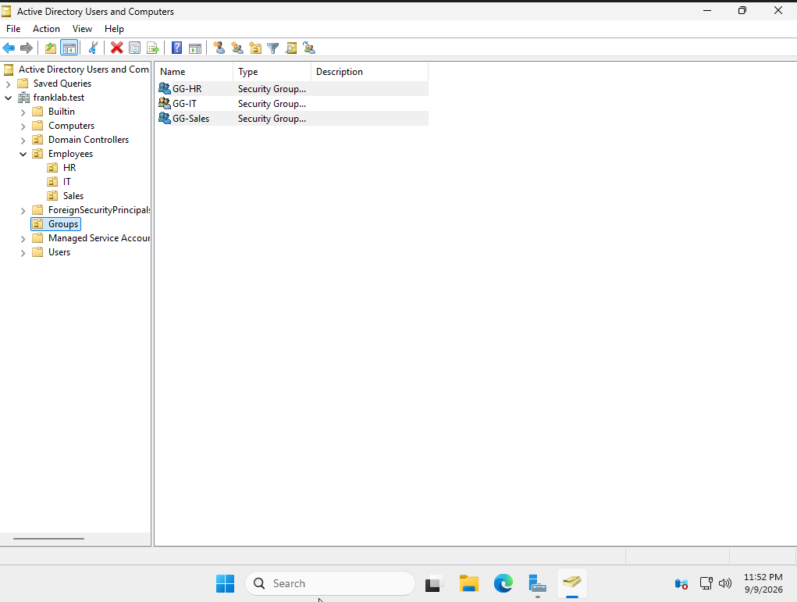
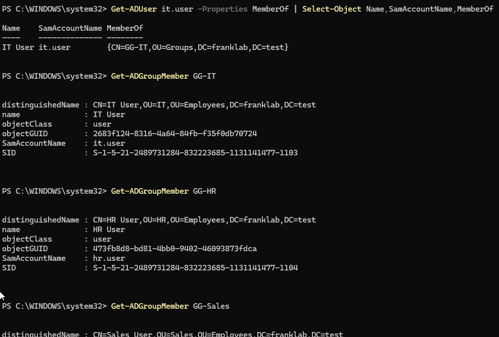
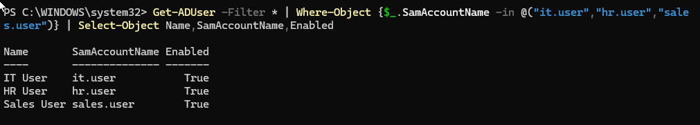

# Lab 08 - Active Directory Users, Groups, and Organizational Units

## Objective

Configure and organize Active Directory objects inside the `franklab.test` domain by creating Organizational Units, domain user accounts, and departmental security groups.

The goal of this lab was to practice centralized identity and access management using both Active Directory Users and Computers and PowerShell.

---

## Environment

- **Domain:** franklab.test
- **Domain Controller:** DC01
- **Operating System:** Windows Server 2025 Standard Evaluation
- **Directory Service:** Active Directory Domain Services
- **Management Tools:** Active Directory Users and Computers and PowerShell

---

## Organizational Unit Structure

I created an `Employees` Organizational Unit to organize domain users by department.

Inside the `Employees` OU, I created three departmental OUs:

`HR`

`IT`

`Sales`

I also created a separate `Groups` OU to store departmental security groups.

The resulting structure was:

`franklab.test`

`Employees`

`HR`

`IT`

`Sales`

`Groups`

Using separate Organizational Units provides a structured way to organize Active Directory objects and will allow policies to be applied to specific departments later using Group Policy.

---

## Domain User Creation

I created three domain user accounts and placed each account inside its corresponding departmental OU.

The accounts were:

`it.user`

`hr.user`

`sales.user`

The users were organized as follows:

`it.user` was placed in the `IT` OU.

`hr.user` was placed in the `HR` OU.

`sales.user` was placed in the `Sales` OU.

This demonstrated how Active Directory can centrally manage identities while keeping users logically organized by department.

---

## Security Group Creation

I created three departmental security groups inside the `Groups` OU:

`GG-IT`

`GG-HR`

`GG-Sales`

Each group was configured as a:

`Global Security Group`

Global security groups can be used to group users with similar access requirements and later assign permissions to resources based on group membership rather than individual accounts.

---

## Group Membership Configuration

I added each departmental user to the appropriate security group.

The assignments were:

`it.user` → `GG-IT`

`hr.user` → `GG-HR`

`sales.user` → `GG-Sales`

I verified the memberships using PowerShell commands such as:

`Get-ADGroupMember GG-IT`

`Get-ADGroupMember GG-HR`

`Get-ADGroupMember GG-Sales`

I also inspected user membership information using:

`Get-ADUser it.user -Properties MemberOf | Select-Object Name,SamAccountName,MemberOf`

This confirmed that the users were associated with their correct departmental security groups.

---

## Account Verification

I used PowerShell to verify that the newly created accounts were enabled.

Command used:

`Get-ADUser -Filter * | Where-Object {$_.SamAccountName -in @("it.user","hr.user","sales.user")} | Select-Object Name,SamAccountName,Enabled`

The results confirmed:

`IT User      it.user      True`

`HR User      hr.user      True`

`Sales User   sales.user   True`

This confirmed that all three domain accounts were active and available for future domain authentication testing.

---

## PowerShell Verification

I also used PowerShell to inspect Active Directory Organizational Units and security groups.

To inspect OUs:

`Get-ADOrganizationalUnit -Filter * | Select-Object Name,DistinguishedName`

The results showed the `Employees`, `Groups`, `IT`, `HR`, and `Sales` Organizational Units.

To inspect departmental security groups:

`Get-ADGroup -Filter 'Name -like "GG-*"' | Select-Object Name,GroupScope,GroupCategory`

The results confirmed:

`GG-HR     Global     Security`

`GG-IT     Global     Security`

`GG-Sales  Global     Security`

This verified that the groups were created with the intended scope and type.

---

## What I Learned

This lab helped me understand how Active Directory organizes and manages identities.

I learned the difference between Organizational Units, user accounts, and security groups.

Organizational Units provide structure and allow administrators to organize users and computers.

User accounts represent individual identities that can authenticate to the domain.

Security groups allow administrators to assign access based on job role or department rather than configuring permissions separately for each person.

I also practiced verifying Active Directory configuration using PowerShell instead of relying only on graphical tools.

The access-management model used in this lab was:

**User → Department → Security Group → Resource Permissions**

This provides a more scalable approach to managing access in an organization.

---

## Screenshots

### HR Domain User

The `HR User` account was created inside the HR Organizational Unit.

### IT Domain User

The `IT User` account was created inside the IT Organizational Unit.

### Sales Domain User

The `Sales User` account was created inside the Sales Organizational Unit.

### Department Security Groups

The `GG-HR`, `GG-IT`, and `GG-Sales` Global Security Groups were created inside the Groups Organizational Unit.

### Group Membership Verification

PowerShell was used to verify membership in the departmental security groups.

### Active Directory PowerShell Verification

PowerShell confirmed that the IT, HR, and Sales domain accounts were enabled and available for use.