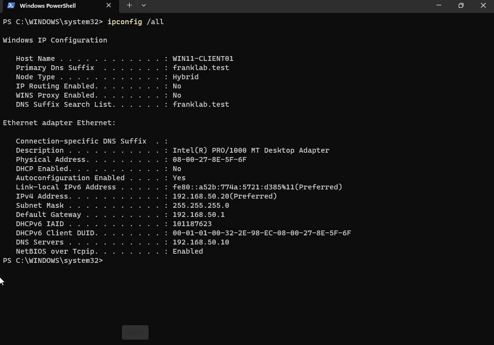
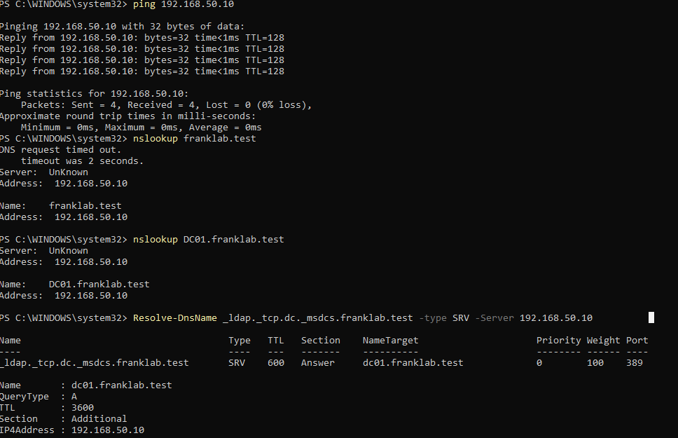
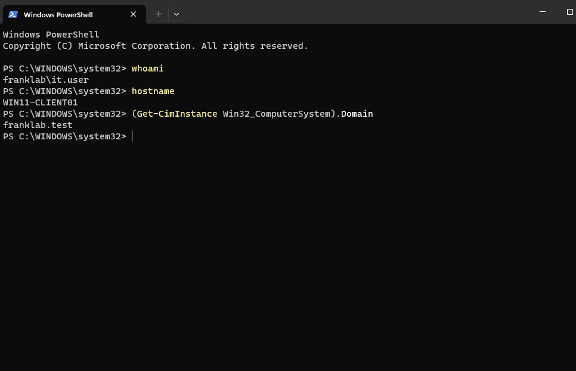
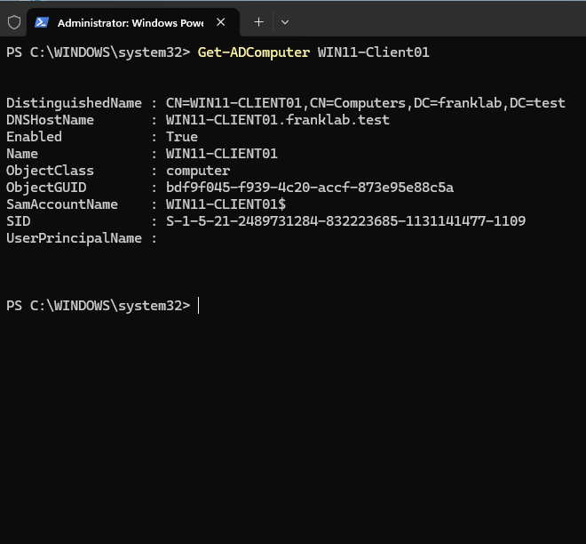
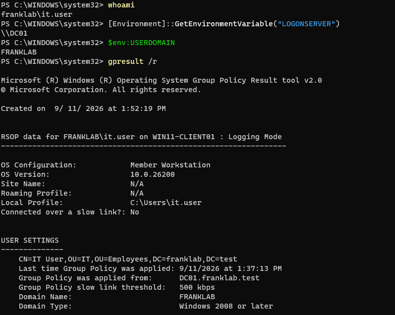

# Lab 09 - Windows 11 Domain Join and Domain Authentication

## Objective

Join the Windows 11 client to the `franklab.test` Active Directory domain, verify DNS-based Domain Controller discovery, authenticate with a domain user account, and confirm that the workstation is registered and managed as a domain member.

---

## Environment

- **Domain:** franklab.test
- **Domain Controller:** DC01
- **Domain Controller IP:** 192.168.50.10
- **Windows Client:** WIN11-CLIENT01
- **Client IP:** 192.168.50.20
- **Default Gateway:** 192.168.50.1
- **Client DNS Server:** 192.168.50.10
- **Domain User:** it.user
- **NetBIOS Domain:** FRANKLAB

---

## Client Network Configuration

Before joining the domain, I configured the Windows 11 client with a static IPv4 address.

The client configuration was:

- **Hostname:** WIN11-CLIENT01
- **IPv4 Address:** 192.168.50.20
- **Subnet Mask:** 255.255.255.0
- **Default Gateway:** 192.168.50.1
- **DNS Server:** 192.168.50.10
- **DHCP:** Disabled

The client was configured to use the Domain Controller as its DNS server.

This is required because Active Directory clients use DNS to locate Domain Controllers and domain services.

---

## Domain Controller Connectivity

I verified basic connectivity from `WIN11-CLIENT01` to `DC01` using:

`ping 192.168.50.10`

The test completed successfully with no packet loss.

This confirmed that the Windows client could communicate with the Domain Controller over the lab network.

---

## DNS Validation

I verified Active Directory DNS resolution using:

`nslookup franklab.test`

I also verified the Domain Controller hostname using:

`nslookup DC01.franklab.test`

Both names successfully resolved to:

`192.168.50.10`

I then queried the Active Directory LDAP service record using:

`Resolve-DnsName _ldap._tcp.dc._msdcs.franklab.test -Type SRV -Server 192.168.50.10`

The result returned:

`dc01.franklab.test`

using LDAP TCP port:

`389`

This confirmed that the Windows client could locate the Domain Controller through Active Directory DNS service records.

---

## Domain Join

After verifying networking and DNS, I joined the Windows 11 client to the Active Directory domain:

`franklab.test`

Domain Administrator credentials were used to authorize the domain join.

After the join completed, the workstation was restarted.

---

## Domain User Authentication

After the restart, I logged into the workstation using the domain account:

`FRANKLAB\it.user`

I verified the authenticated identity using:

`whoami`

The result was:

`franklab\it.user`

I verified the workstation name using:

`hostname`

The result was:

`WIN11-CLIENT01`

I then verified domain membership using:

`(Get-CimInstance Win32_ComputerSystem).Domain`

The result was:

`franklab.test`

This confirmed that the client had successfully joined the Active Directory domain and that the user session was authenticated using a domain account.

---

## Active Directory Computer Object

On DC01, I verified that the Windows client had been added to Active Directory using:

`Get-ADComputer WIN11-CLIENT01`

The result confirmed:

- **Computer Name:** WIN11-CLIENT01
- **DNS Host Name:** WIN11-CLIENT01.franklab.test
- **Enabled:** True

This confirmed that Active Directory recognized the Windows 11 workstation as a domain member.

---

## Logon Server Verification

On the Windows 11 client, I verified the authentication environment.

I ran:

`whoami`

The result confirmed:

`franklab\it.user`

I checked the Active Directory domain using:

`$env:USERDOMAIN`

The result was:

`FRANKLAB`

I identified the Domain Controller used for authentication with:

`[Environment]::GetEnvironmentVariable("LOGONSERVER")`

The result was:

`\\DC01`

This confirmed that the user authenticated against the Domain Controller rather than a local account.

---

## Group Policy Verification

I used:

`gpresult /r`

to inspect the domain user's Group Policy information.

The output confirmed:

- The workstation was operating as a domain member.
- The logged-in account belonged to the FRANKLAB domain.
- Group Policy information was being retrieved from `DC01.franklab.test`.

This confirmed that the Windows client was functioning as an Active Directory managed workstation.

---

## Authentication Flow

The authentication process in this lab was:

**Domain User Credentials**

↓

**WIN11-CLIENT01 queries Active Directory DNS**

↓

**DNS locates DC01**

↓

**DC01 authenticates the domain user**

↓

**Active Directory authorizes the login**

↓

**Domain user receives a Windows session**

This demonstrated the relationship between DNS, Active Directory, Domain Controllers, computer objects, and domain authentication.

---

## What I Learned

This lab demonstrated how a Windows workstation becomes part of a centralized Active Directory environment.

I practiced:

- Configuring a static IPv4 address on a Windows client
- Configuring the client to use an Active Directory DNS server
- Testing connectivity to a Domain Controller
- Resolving Active Directory DNS records
- Querying LDAP SRV records
- Joining a Windows workstation to an Active Directory domain
- Logging in with a domain user
- Verifying domain membership
- Verifying the Domain Controller used for authentication
- Verifying Active Directory computer objects
- Reviewing Group Policy results

This lab connected the Windows Server and Windows client portions of the home lab into a functioning domain environment.

---

## Screenshots

### Windows Client Static Network Configuration

`WIN11-CLIENT01` was configured with the static IPv4 address `192.168.50.20`, default gateway `192.168.50.1`, and DNS server `192.168.50.10`.

### Active Directory DNS Validation

The Windows client successfully reached DC01, resolved the Active Directory domain and Domain Controller hostname, and located the LDAP service through an Active Directory SRV record.

### Domain User Login

PowerShell confirmed that `it.user` was authenticated through the `FRANKLAB` domain on `WIN11-CLIENT01`.

### Active Directory Computer Object

DC01 confirmed that `WIN11-CLIENT01` existed as an enabled computer object in Active Directory.

### Domain Authentication Verification

PowerShell and `gpresult` confirmed the domain user, FRANKLAB domain, DC01 logon server, and domain Group Policy environment.