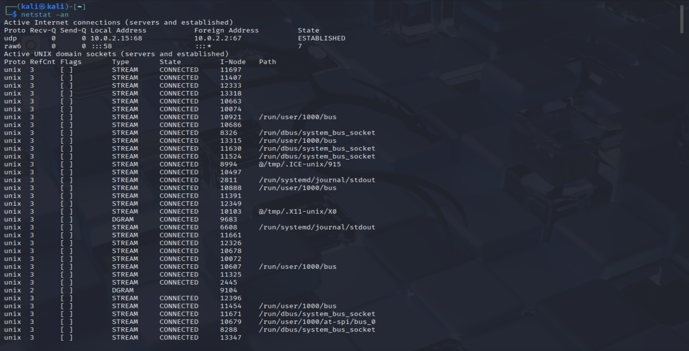

# Netstat Command Lab

## Goal
Learn how to use the `netstat` command to view active network connections and listening ports.

---

## Command Used

### 1. `netstat -tuln`
- **What it does:** Shows all active TCP/UDP listening ports with numeric addresses.
- **Why it matters:** Helps identify which services are running on your machine and what ports they are listening to.

**Example I ran:**
```bash
netstat -tuln
```
### What to look at:
- **Proto (TCP/UDP)**: Which protocol is being used
- **Local Address (IP port)**: Which port your computer is listening on
- **State**: Look for LISTEN (service waiting for connections)

**Screenshot:**


---

### 2. `netstat -an`
- **What it does:** Displays all active connections and listening ports with IP addresses
- **Why it matters:** Useful for checking if your system is making connections to unexpected places

**Example I ran:**
```bash
netstat -an
```
### What to look at:
- **Local Address:** Your system’s IP and port
- **Foreign Address:** The remote IP and port your computer is connected to
- **State:**

- `ESTABLISHED` → an active connection.

- `LISTEN → waiting` for connections.

- `TIME_WAIT` / `CLOSE_WAIT` → connection closing.

**Screenshot:**


---

## What I Learned
- `netstat -tuln` → focus on **LISTENING ports** to see what services are running
- `netstat -an` → focus on **ESTABLISHED connections** to see where your machine is connected
- Unexpected or strange **foreign addresses** may indicate malicious connections.

---

## Why It Matters in Cybersecurity
- SOC analysts use netstat to detect malware that opens hidden connections.
- Attackers often use unusual ports (not 22/80/443). Spotting these is a red flag.
- Helps in incident response by quickly showing all live network activity.
