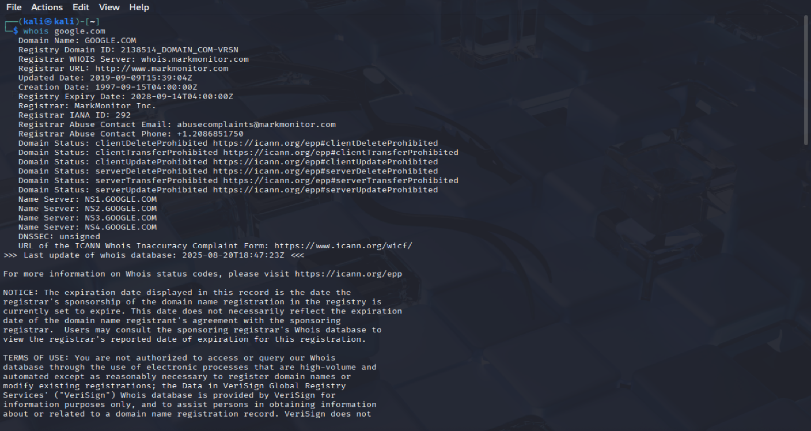
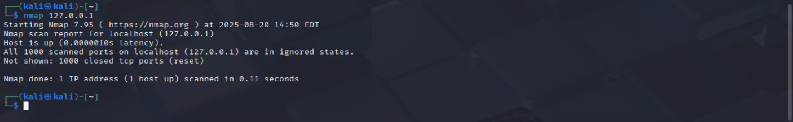

# Recon & Scanning Basics

## Goal
Learn how to gather information about domains and scan a host for open ports using `whois` and `nmap`.
These are foundational recon tools in cybersecurity.

---

## 1. `whois`
- **What it does:** Queries domain registration details (owner, registrar, contact info, creation/expiry dates).
- **Why it matters:** Useful for investigating suspicious domains or verifying legitimate ownership.

**Examples I ran:**
```bash
whois google.com
```

**Screenshots:**


---

## 2. `nmap`
- **What it does:** Scans a host to discover open ports and services running on it.
- **Why it matters:** Core tool for penetration testing, vulnerability scanning, and network defense.

**Examples I ran:**
```bash
nmap 127.0.0.1
```

**Screenshots:**


---

## What I Learned
- `whois` shows domain registration info, which can reveal suspicious ownership patterns.
- `nmap` identifies open ports and services, which attackers could exploit if not secured.
- Together, these tools form the first steps of reconnaissance in cybersecurity.

