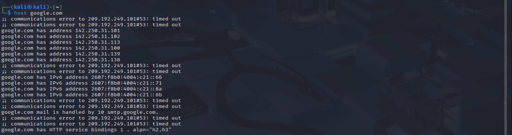

# Host Command Lab

## Goal
Understand how the `host` command is used to query DNS records and identify the key details that matter in networking and cybersecurity.

---

## Commands Used

### 1. `host google.com`
- **What it does:** Resolves a domain name to its IP address.
- **What to look at (crucial):**  
  - The **IP address** returned `142.250.31.101`.  
  - This tells you where the domain actually lives on the internet.  
- **Why it matters in security:** Attackers/defenders often resolve domains to IPs to map targets, block malicious servers, or check for DNS poisoning.

**Screenshot:**

---

### 2. `host -t MX google.com`
- **What it does:** Shows the Mail Exchange (MX) records for the domain.
- **What to look at (crucial):**  
  - The **mail server hostnames** `smtp.google.com`.  
  - The **priority number** (lower = higher priority).  
- **Why it matters in security:**  
  - Email servers are a common attack vector (phishing, spoofing).  
  - Knowing MX records shows where a company handles its mail traffic.

**Screenshot:**

---

### 3. `host -t NS google.com`
- **What it does:** Shows the Name Servers (NS) responsible for the domain.
- **What to look at (crucial):**  
  - The **NS hostnames** `ns1.google.com`.  
  - These are the authoritative DNS servers that control the domain’s records.  
- **Why it matters in security:**  
  - If an attacker compromises an NS server, they could redirect all traffic for that domain.  
  - Defenders check NS records when investigating DNS hijacking or misconfigurations.

**Screenshot:**

---

## What I Learned
- `host` is a lightweight way to query DNS records compared to `dig`.  
- Each record type tells you something different:
  - **A record (default)** = Domain → IP mapping.  
  - **MX record** = Email servers + their priorities.  
  - **NS record** = Which servers control the DNS zone.  
- The crucial part of using `host` is knowing **which field to focus on** (IP, mail server, or name server).  

---

## Why It Matters in Cybersecurity
- Network defenders use DNS lookups to confirm legitimate services.  
- Attackers use the same lookups for reconnaissance before launching attacks.  
- Being able to quickly spot the **important values** (IP addresses, MX servers, NS servers) is a key skill in investigations.

