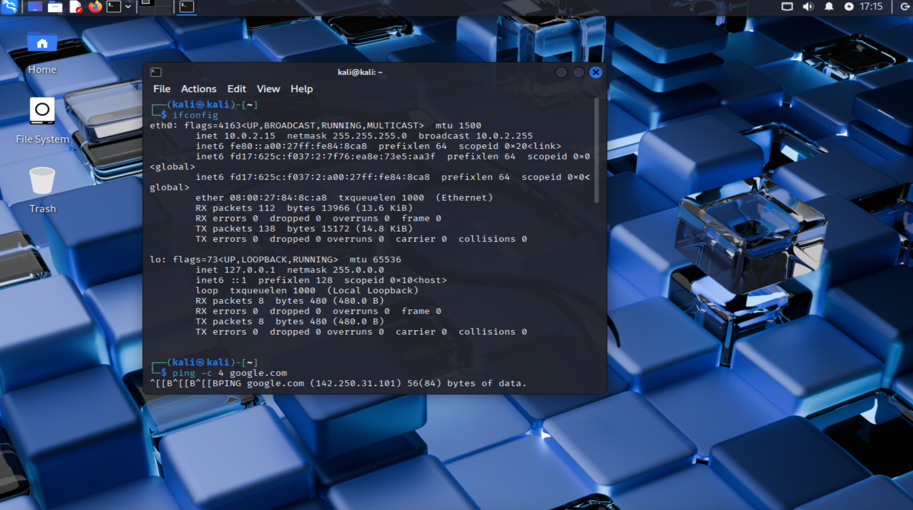
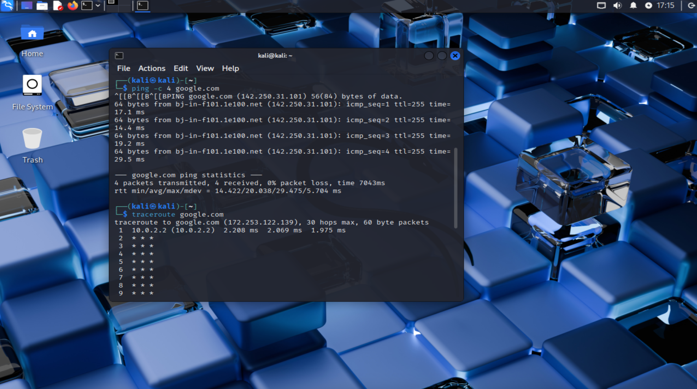
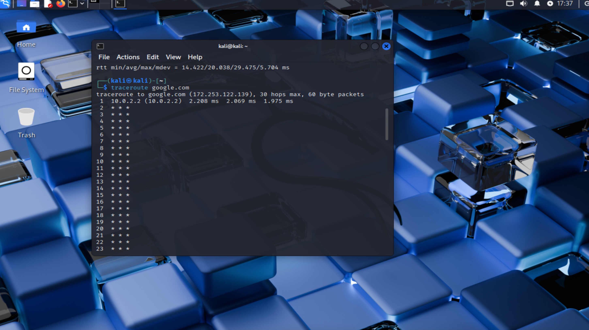

# Networking Basics Lab

## Goal
Practice basic Linux networking commands (`ifconfig`, `ping`, `traceroute`) and document results to build hands-on experience.

---

## Commands Used

### 1. `ifconfig`
- **What it does:** Shows your network interfaces (like Wi-Fi, Ethernet, loopback).
- **Why it matters:** Helps identify your machine's IP address and check connectivity setup.

**Screenshot:**


---

### 2. `ping`
- **What it does:** Sends small packets to a server (like Google) and checks if they come back.
- **Why it matters:** Used to measure internet connectivity and measure response time (latency).

**Example I ran:**
```bash
ping -c 4 google.com
```


**Screenshot:**


---

### 3. `traceroute`
- **What it does:** Shows each “hop” your data takes to reach a destination. 
- **Why it matters:** Useful for troubleshooting — tells you where in the network path a slowdown or block is happening.

**Screenshot:**


---

## What I learned
- `ifconfig` shows both local (private) and loopback (127.0.0.1) addresses.
- `ping` confirmed I had internet access and gave me latency numbers (17–29ms).
- `traceroute` revealed the first hop (my VM’s gateway) but later hops didn’t respond — which is normal since many routers block traceroute packets.

---

## Why it Matters in Cybersecurity
- SOC Analysts use ping to test network connectivity quickly.
- Network engineers use ifconfig (or ip addr) to troubleshoot IP issues.
- Traceroute helps identify where network traffic is being blocked — useful in detecting firewalls, misconfigured routers, or even attacks
